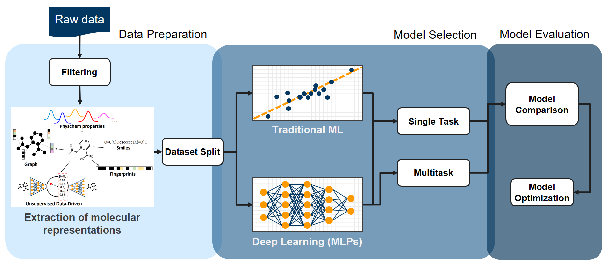

# Benchmarking and Property Prediction Framework (PREFER)

The PREFER framework automatizes the evaluation of different combinations of molecular representations and machine learning models for predicting molecular properties. 
It covers different molecular representation from classical, e.g. Fingerprints and 2D Descriptors, to data-driven representations, e.g. Continuous and Data Driven representations (CDDD) [1] or MoLeR[2].
PREFER uses AutoSklearn [3] to implement the ML model selection and the hyperparameter tuning.



*General overview of the PREFER framework where the Model Selection part is based on [3].*

## Getting Started

### Installation

#### Python Environment
The main conda environment for using PREFER can be installed from `prefer-environment.yml`, as follows:

```
conda env create -f prefer-environment.yml
```

Depending to the models employed to generate model-based molecular representations, other environments need to be installed (one for each model). The supported models in the current PREFER code are CDDD [1] and MoLeR [2]. The corresponding environments can be found in `moler-environment-light.yml` and `cddd-environment-light.yml` and can be installed as follows:

```
conda env create -f moler-environment-light.yml
OR
conda env create -f cddd-environment-light.yml
```

Before running any experiments, relevant paths need to be set (including cddd and moler folders which are integrated in PREFER as git submodules), as follows:

```
PYTHONPATH="path_to/PREFER/prefer/model_based_representations/models/cddd/:path_to/PREFER/prefer/model_based_representations/models/molecule-generation/:path_to/PREFER/:$PYTHONPATH"
export PYTHONPATH
```

New models should be included as git submodules and add in the PYTHONPATH.

#### Conda Environments in Jupyter 
To use the PREFER conda environment in a Jupyter notebook, the environment needs to be added to Jupyter's kernelspec:

```
conda activate prefer-env
python -m ipykernel install --user --name prefer-env --display-name "Python (prefer-env)"
```

Check that Jupyter has access to this environment by running 

```
jupyter kernelspec list
```

The recently added env `Python (prefer-env)` should be available now in Jupyter. 


## Prerequisites

In order to run PREFER, we provide one notebook (Run-PREFER.ipynb) and one python script (run_prefer_automation.py) 

Main steps are as follows:

### STEP 0: clone the repository and unpack the git submodules
Once you have cloned this repository, please go into your cloned folder and run the following commands:

```
git submodule update --init --recursive
```

This is needed to unpack the git submodules used to connect PREFER to the models used to compute the model-based representations.

### STEP 1: download public test datasets
Two public datasets can be used to test the code:
- [logD](https://www.ebi.ac.uk/chembl/g/#browse/activities/filter/document_chembl_id%3ACHEMBL3301361%20AND%20standard_type%3A(%22LogD7.4%22)) from ChEMBL
- [solubility](https://pubchem.ncbi.nlm.nih.gov/bioassay/1996) from PubChem

### STEP 2: download models for calculating data-based molecular representations
Two models are supported currenlty as submodules in PREFER: CDDD and MOLER. 
Pre-trained models can be dowloaded from:

- CDDD: [here](https://drive.google.com/open?id=1oyknOulq_j0w9kzOKKIHdTLo5HphT99h)
- MOLER: [here](https://figshare.com/ndownloader/files/34642724)

Save these trained models locally, since they will be used afterwards. 


### STEP 3: set the configuration files
For each PREFER job a yaml config file need to be prepared as follows:

1. Main settings:
```
path_to_df: 'path_to_df'
experiment_name: 'experiment_name'
id_column_name:  'id_column_name'
smiles_column_name:  'smiles_column_name'
properties_column_name_list: 
      - 'property_1_col_name'
      - 'property_2_col_name'
problem_type: 'regression' # or 'classification'
splitting_strategy: 'random' # or 'cluster' or 'temporal'
temporal_info_column_name: 'temporal_info_column_name'
```

Examples are provided in ./config_files.

2. Settings for model based representations:
```
model_based_representations:
    'model_name': 
        'path_to_model': 'path to model folder'(see STEP2)
        'conda_env': 'name of the conda env installed for this model'
        'submodule_path': 'path to the submodule folder included in PREFER for running the model'(e.g. path_to/prefer/model_based_representations/models/cddd/)
    
prefer_path: 'path_to_/PREFER/'
```

Examples of configuration file for the representations is provided in ./config_files/config_model_based_representations.yaml.


### STEP 4: run Run-PREFER.ipynb notebook
To run the notebook `Run_PREFER.ipynb`, first of all select the correct kernel (Python (prefer-env)) and then change the needed paths, in particular:

- sys.path.append('path_to/PREFER/')
- sys.path.append('path_to/models/cddd/') # to connect CDDD model
- sys.path.append('path_to/models/molecule-generation/') # to connect MOLER model

By running the notebook a folder (PREFER_results) will be created with the main results (benchmarking object and models). 
Moreover different folders with structure {model_name}_representations_{experiment_name} will be created containing the model_based representations.

In the notebook one can also find an example of how to use the stored PREFER-model-wrapper to predict new samples. This way the best model found for each molecular representation can be used later to predict the property under analysis. 

An automatized version of the notebook can be found in `run_prefer_automation.py`. You can run it from the terminal with the following commands:

```
conda activate prefer-env

PYTHONPATH="path_to/PREFER/prefer/model_based_representations/models/cddd/:path_to/PREFER/prefer/model_based_representations/models/molecule-generation/:path_to/PREFER/:$PYTHONPATH"
export PYTHONPATH

python run_prefer_automation.py --prefer_args path_to_yaml_configuration_file(see STEP3) --model_based_representations_args path_to_yaml_configuration_file_for_models_used_to_compute_the_representations(see STEP4)
```


## WARNING: 
Please make sure that you select the right model type according to the dataset used (e.g.for a classification model binary labels should be provided in the dataset). 

## Authors

* **Jessica Lanini** 

With the contribution of
- Nadine Schneider
- Gianluca Santarossa
- Sarah Lewis
- Krzysztof Maziarz
- Marwin Segler
- Hubert Misztela


## References
[1] Winter, Robin, et al. "Learning continuous and data-driven molecular descriptors by translating equivalent chemical representations." Chemical science 10.6 (2019): 1692-1701.

[2] Maziarz, Krzysztof, et al. "Learning to extend molecular scaffolds with structural motifs." arXiv preprint arXiv:2103.03864 (2021).

[3] Feurer, Matthias, et al. "Efficient and robust automated machine learning." Advances in neural information processing systems 28 (2015).
